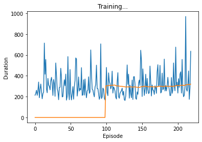

# Deep Reinforcement Learning: Playing Atari games 🎮

**Ressources** used for this project can be found in the **ressources.txt** file.

 

## What is Deep Reinforcement Learning?
  

Deep Reinforcement learning is a combination of reinforcement learning and deep learning. The goal is for the computer to learn from their actions in a similar way humans would learn from their experiences.

In reinforcement learning, the problem is not supervised, meaning we let the computer explore the environment by itself and we only give it a reward signal when he takes a good or bad action. This is what we will be implementing later on.

We combine RL with deep learning, and neural networks, which will allow us to estimate values which we can't compute exactly.
Then in our games, we will know the optimal action we should take at each moment as to gain the maximum points!

All those concepts are further explained in this README file as well as in the notebooks.

  

### And what about DQN?

  
 
DQN is one of the basic deep RL algorithm which exists.
It is here to predict the best action, as we are sometimes unable to get the true values of certain function. Here, we will want to know what action is the best to take in a specific state of the game, by looking at future rewards.

Below is the Deep Q-Learning algorithm which was introduced by Mnih et al. 2013. 

> The goal of DQN is "to connect a reinforcement learning algorithm to a deep neural network which operates directly on RGB images and efficiently process training data by using stochastic gradient updates."

  

### Details on a Markov Decision Process

  

First, let's remember that a markov state is a state $S_t$ such that the next state $S_{t+1}$ only depends on the current state $S_t$ but not on the previous states $(S_{1}  , ... , S_{t-1})$.
Then, a markov decision process is an environment in which all states are Markov. 

Mathematically, we can define it as a tuple < $S,A,P,R,\gamma$ > where 
* $S$ is a finite set of states 
* $A$ a finite set of actions
* $P$ a state transition probability matrix with $P_{ss' a} = P(S_{t+1} = s' \rvert S_t=s, A_t=a)$
* $R$ is a reward function and $\gamma$ a discount factor with $R_{s a} = E(R_{t+1} \rvert St=s, At=a)$

Then, we can define a policy as $\pi(a \rvert s) = P(A_t = a \rvert S_t = s)$ and the action value function as $q_{\pi}(s,a) = E_{\pi}[R_{t+1} + \gamma q_{\pi}(S_{t+1},A_{t+1}) \rvert S_t=s, A_t=a)]$.

Let's remember that the Bellman equation is specifically $v = R + \gamma P v$ with $v$ the state-value function.

An optimal policy can be found by maximising over $q∗(s,a)$ such that if we know $q∗(s,a)$, we immediately have the optimal policy.
Then, soving the Bellman equation can then be done iteratively by Q-learning, and in our case, by the DQN algorithm above.

  
 
 

## The games I trained the computer to played:

  

I tried to implement a DQN algorithm on CartPole and Breakout from the gym environment. Using this environment allows the user to easily observe and take an action in the game. It also allows to easily access the rewards and the next state of the environment.

Both games have a discrete action spaces, Cartpole can only move right or left and Breakout has two more actions available: do nothing and fire.
However the differ in the observations, as Cartpole's states are defined with a vector of 4 parameters while Breakout's states are defined by a full RGB image.

Further explanation on the observation and action spaces are available in the notebook.

  

## Cartpole

  

We get the following improvments after I train my computer to play cartpole:

Cartpole before training           |  Cartpole after training
:---------------------------------:|:---------------------------------:
  |  

Furthermore, here are some plots of the evolutions of the game in two different training sessions:
We observe that training is quite unstable, but the computer learns quite well if we give it enough time. It even hits the maximum duration possible really fast in the second example.

  

  

  

## Breakout

  

Breakout before training           |  Breakout after training (Not obtained with my DQN)
:---------------------------------:|:---------------------------------:
 | 

 

As we can see, the agent did not learn a lot trough its training. Even if the number of game played is low, it is not the only reason for those poor results. Such reasons are explained in the last part below.

## The issues..

  

As you can see, the agent did not learn well on the breakout game. 

I wanted to keep the algorithm I used for cartpole as it worked very well to train this game. However, major changes had to be implemented for the algorithm to work on breakout so it might not have been the best idea.

The main difference has been the observation space which was no longer a simple vector of length 4 but a full RGB image. Furthermore, cartpole was rewarded at almost each step, as it gained reward from staying up-right at each step. However, in breakout, rewards are much more delayed, as it takes multiple frames/states until we hit a brick.

Firstly, using the RGB image as it is has proven to be difficult, as it's not efficient to train on. The papers proposed to turn the image in a grayscale and to crop it in a 84x84 matrix.
However, I had difficulities implementing it in my code as I was using torch rather than tanserflow and I ran in problems with the tensorflow library, with certain versions not working well.

Furthermore, as we observe only one image, we don't have a sense of which direction the ball might be moving in. I forgot this problem at first and this is I think the biggest reason why my agent doesn't learn.
The litterature recommands using a four stacked frames, which I was not able to correctly implement as I was running in issues with the the different sizes of the elements and I ran out of time. Furthermore, there is a specific associated neural network which shoudl optimize the learning of the agent.
I did include the notebook I was working on but which I did not manage to finish, as they expose import functions.

  

### How to reproduce the results

  
 
 There are three notebooks which I created. 
 The are very similar, only a few functions change each time. I would recommand reading Cartpole as it is the most complete in terms of commentary of the code.
 
 The unfinished one presents functions which if implemented correclty could allow for better results on breakout. The changes are specified at the begining of the notebook.

All the packages and libraries needed are specified at the beggining of the file, including packages I needed to install. 
There is one installation which requiered to kill the kernel and this prevents the notebook from running entirely at once. However, from 1. Packages forward, there should be no issues.

No dataset were needed for this implementation.
