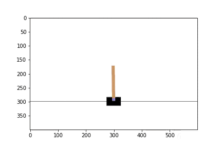
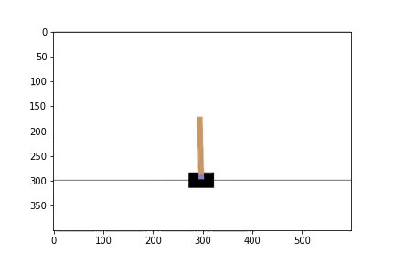
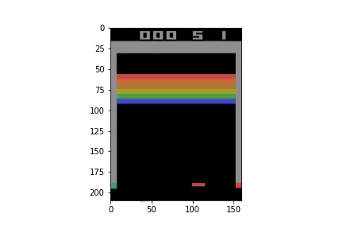

# Deep Reinforcement Learning: Playing Atari games 🎮

Deep Reinforcement learning is a combination of reinforcement learning and deep learning. 

Implementation of DQN algorithm on CartPole and Breakout from gym environment

Our games have a discrete action spaces, Cartpole can only move right or left and Breakout has two more actions available: do nothing and fire.

Cartpole before training           |  Cartpole after training
:---------------------------------:|:---------------------------------:
  |  

