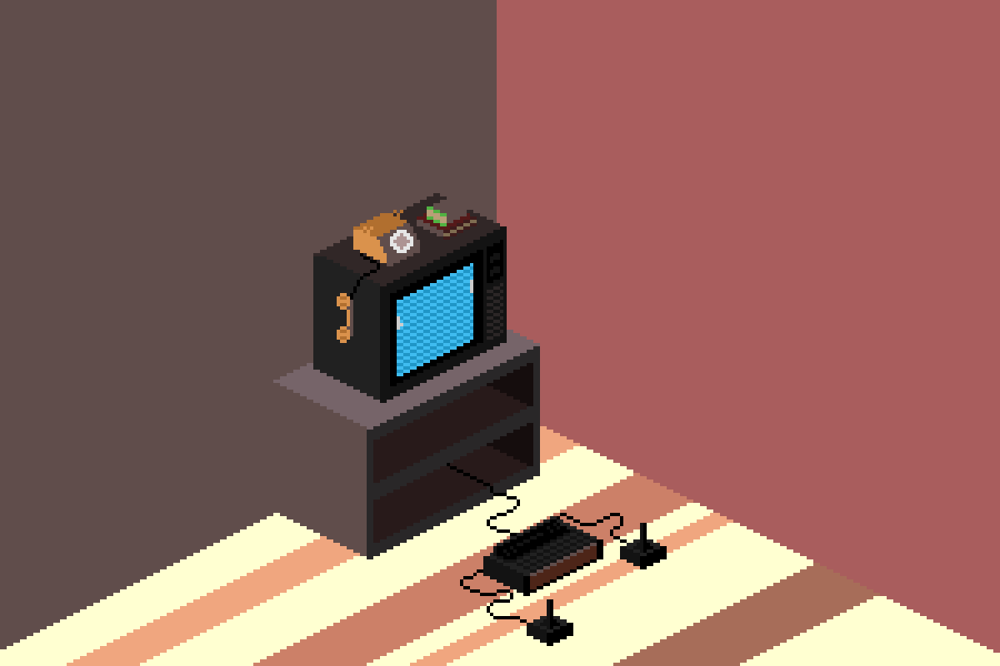
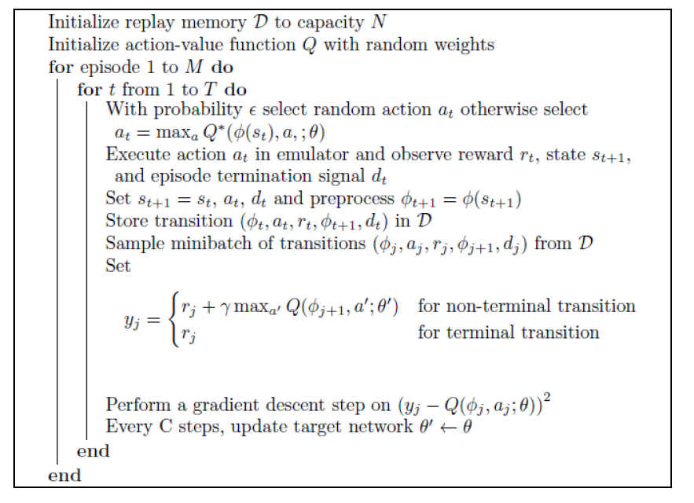
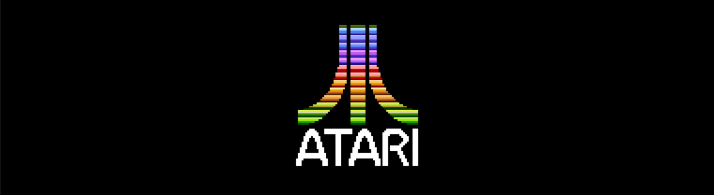
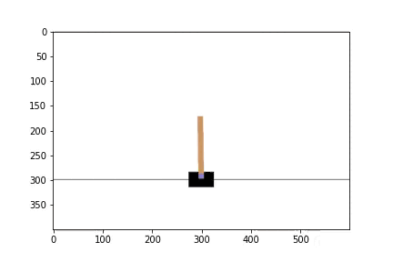
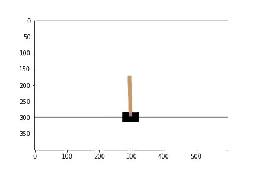
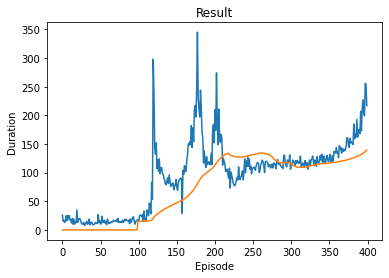
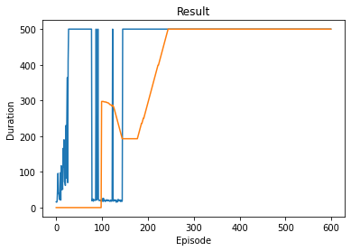
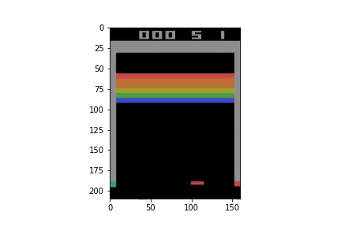
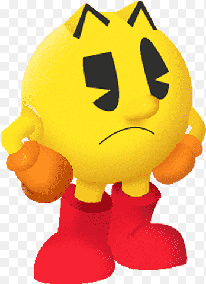

# Deep Reinforcement Learning: Playing Atari games 🎮

 

## What is Deep Reinforcement Learning?

Deep Reinforcement learning is a combination of reinforcement learning and deep learning. 

In reinforcement learning, the problem is not supervised, meaning we let the computer explore the environment by itself and we only give it a reward signal when he takes a good or bad action.

### And what about DQN?
Below is the Deep Q-Learning algorithm which was introduced by Mnih et al. 2013. DQN is here to predict the best action, as we cannot get the true $Q*(s,a)$.
> The goal of DQN is "to connect a reinforcement learning algorithm to a deep neural network which operates directly on RGB images and efficiently process training data by using stochastic gradient updates."

### Details on a Markov Decision Process

First, let's remember that a markov state is a state $S_t$ such that the next state $S_{t+1}$ only depends on the current state $S_t$ but not on the previous states $(S_{1}  , ... , S_{t-1})$.
Then, a markov decision process is an environment in which all states are Markov. 

Mathematically, we can define it as a tuple < $S,A,P,R,\gamma$ > where 
* $S$ is a finite set of states 
* $A$ a finite set of actions
* $P$ a state transition probability matrix with $P_{ss' a} = P(S_{t+1} = s' \rvert S_t=s, A_t=a)$
* $R$ is a reward function and $\gamma$ a discount factor with $R_{s a} = E(R_{t+1} \rvert St=s, At=a)$

Then, we can define a policy as $\pi(a \rvert s) = P(A_t = a \rvert S_t = s)$.
We can also define the action value function: 

$q_{\pi}(s,a) = E_{\pi}[R_{t+1} + \gamma q_{\pi}(S_{t+1},A_{t+1}) \rvert S_t=s, A_t=a)]$

An optimal policy can be found by maximising over $q∗(s,a)$ such that if we know $q∗(s,a)$, we immediately have the optimal policy.

Soving the Bellman equation can then be done iteratively by Q-learning, and the DQN algorithm above
  
 

## The games we played:

I tried to implement a DQN algorithm on CartPole and Breakout from the gym environment. Using this environment allows us to easily observe and take an action in the game. It allows to easily access the rewards and the next state of the environment.

Both games have a discrete action spaces, Cartpole can only move right or left and Breakout has two more actions available: do nothing and fire. Further explanation are available in the notebook.

## Cartpole

We get the following improvments after I train my computer to play cartpole:

Cartpole before training           |  Cartpole after training
:---------------------------------:|:---------------------------------:
  |  

Furthermore, here are some plots of the evolutions of the game in two different training sessions:
We observe that training is quite unstable, but the computer learns quite well if we give it enough time. It even hits the maximum duration really fast in the second example.
  

## Breakout

Breakout before training           |  Breakout after training (Not obtained with my DQN)
:---------------------------------:|:---------------------------------:
 | 

## The issues..
  

As you can see, the agent did not learn well on the breakout game. 
I wanted to keep the algorithm I used for cartpole as it worked very well to train this game. However, major changes had to be implemented for the algorithm to work on breakout.
The main difference has been the observation space which was no longer a simple vector of length 4 but a full RGB image. Furthermore, cartpole was rewarded at almost each step, as it gained reward from staying pright at each step. However, in breakout rewards are delayed, as it can take multiple frames/states until we hit a brick.
Using the RGB as it is has proven to be difficult, as it's not efficient to train on. The papers proposed to turn the image in a grayscale and to crop it in a 84x84 matrix.
This has proven difficult as I was using torch rather than tanserflow and was running int problem with the tensorflow library which I was not able to fix.
Furthermore, as we observe only one image, we don't have a sense of which direction the ball might be moving in. For this reason, we need to consider a state as four stacked frames, which I was not able to correctly implement as I was running in issues with the the different sizes of the elements.
I did include the notebook I was working on but which I did not manage to finish.

### How to reproduce the results
